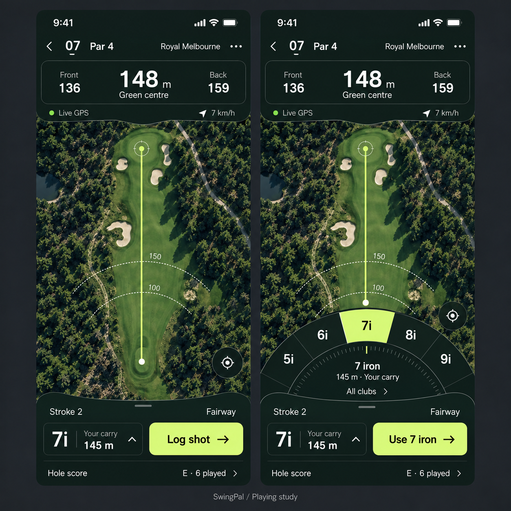

# Playing experience — composition study

21 September 2026 · Proposal, not an accepted or implemented design

## Owner direction

The existing map, radial selection and shot controls are ideas to develop, not a layout contract. The owner explicitly permits substantial layout changes when they improve the product. The goal is a bespoke, visually impressive and integrated experience. Restoring lost controls repairs a regression; it does not complete the redesign.

## What this study explores

The live map becomes the continuous working background. A joined yardage display and a lower equipment/action dock use the same restrained dark material, fine boundaries, white figures and single bright selection colour. Distances establish the hierarchy; smaller front/back readings remain adjacent. The map retains substantial usable space.

Club selection grows from the lower dock into a fan, rather than appearing as a separate collection of bubbles. Broad sectors make the selected club recognisable. The central readout connects its full name and entered carry to the trigger. Selecting a club and recording a shot remain separate actions. A labelled full-bag route preserves access beyond the visible choices.

These are candidate geometry, colour and layout decisions, not frozen specifications. Native implementation must decide the best sector count from the available clubs and screen size. It must keep tap alternatives, accessible input, meaningful data sources and all current playing phases.

## Evidence and limits

- `composition-v2.png` is an image-generated design study with approximately realistic phone proportions. It is not native implementation evidence. The course aerial image, hole identity, wind and yardages are illustrative, not a representation of Royal Melbourne's actual seventh hole.
- `composition-v1.png` is an earlier proportion study. Its screens were too tall and exaggerated the available map space. It must not guide native dimensions.
- The generated image retains an extra boundary around the club trigger despite the refinement prompt. Whether that boundary is useful should be resolved in the native layout, not treated as a requirement.
- The image does not validate data binding, hit targets, mapping geometry, scrolling, Dynamic Type, VoiceOver, Reduce Motion, Reduce Transparency, light appearance or physical outdoor readability.
- A native implementation must derive lie, stroke, distances and carry source from actual state. It must not infer a fairway lie or display fabricated GPS quality. Unavailable location must preserve manual scoring and remove unsupported live distances.
- Map camera framing must account for both visible controls and the opened selector. Text and the player's target must remain visible on compact devices.

Both studies used the built-in image generation tool. Exact prompts are recorded in [PROMPTS.md](PROMPTS.md). No generated map is proposed as an app map or bundled course asset.
